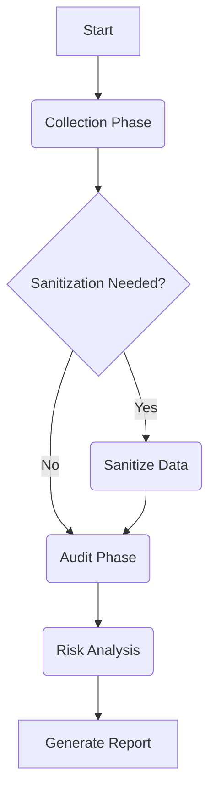

# 🧠 How GHOSTMAP Works

This document explains the inner workings of GHOSTMAP in simple terms. It covers both the **step-by-step workflow** and the **underlying code logic**.

## 🔄 The Workflow (Step-by-Step)

Imagine GHOSTMAP as a team of digital archaeologists and security guards working together.

### Phase 1: The Collection (Archaeology)
**Goal:** Find every URL that has *ever* existed for your target domain.
1.  **Time Travel**: GHOSTMAP asks the **Wayback Machine** and **Common Crawl**: "Show me every page you've seen for `example.com` in the last 10 years."
2.  **JavaScript Mining**: It downloads JavaScript files (like `app.js`) and extracts API endpoints hidden inside the code.
3.  **Deduplication**: It cleans the list. If it finds `page.php?id=1` and `page.php?id=2`, it knows they are the same "endpoint" and keeps only one.

### Phase 2: The Audit (Security Guard)
**Goal:** Check which old URLs are still alive and if they are dangerous.
1.  **Live Probing**: It sends a gentle "Are you there?" (HEAD/GET request) to every URL found in Phase 1.
2.  **Ghost Detection**: It looks at your official API documentation (Swagger/OpenAPI).
    *   If a live URL is **NOT** in your documentation, it marks it as a **Ghost Endpoint**.
3.  **Smart Fuzzing**:
    *   It guesses hidden paths based on the technology.
    *   *Example:* If it sees a Java server, it checks for `/actuator/health`. If it sees PHP, it looks for `config.php`.
4.  **WAF Evasion**: If the server says "Stop!" (429 Too Many Requests), GHOSTMAP apologizes, waits, and slows down automatically.

### Phase 3: Reporting
**Goal:** Show you what matters.
*   It calculates a **Risk Score** for every endpoint.
*   It generates an HTML/PDF report or launches a dashboard.

---

## 💻 Code Structure (Under the Hood)

Here is how the files in the `ghostmap/` folder correspond to the features above:

### 1. The Commander (`ghostmap/cli.py`)
*   **Role**: The brain of the operation.
*   **Function**: It reads your commands (`collect`, `audit`) and tells the other modules what to do. It also loads your `config.yaml`.

### 2. The Scouts (`ghostmap/collector/`)
*   `wayback.py`: Talks to the Internet Archive API.
*   `commoncrawl.py`: Searches the massive Common Crawl database.
*   `js_miner.py`: Download and parses JavaScript files using regular expressions to find URLs.
*   `dedup.py`: The logic for removing duplicate URLs and sorting query parameters.

### 3. The Investigators (`ghostmap/auditor/`)
*   `prober.py`: The engine that sends HTTP requests to check if URLs are alive. It uses **multi-threading** (sending many requests at once) to be fast.
*   `fuzzer.py`: Contains the "Smart Logic" to guess hidden paths based on tech stack signatures.
*   `waf_detector.py`: Detects if a firewall is blocking us.
*   `swagger_parser.py`: Reads your API documentation to understand what *should* exist.

### 4. The Toolbelt (`ghostmap/utils/`)
*   `throttler.py`: Handles the **WAF Evasion**. It pauses execution if errors occur.
*   `config.py`: Managing settings.

---

## 🛡️ Key Algorithms Explained

### "Smart Fuzzing"
Instead of using a dumb list of 1 million words, GHOSTMAP uses **Context Awareness**:
1.  It probes `/`.
2.  It looks at the `Server` header (e.g., `Server: nginx/1.18`).
3.  It selects a specific "wordlist" for Nginx.
4.  This reduces 1,000,000 requests down to 500 *highly probable* guesses.

### "Soft 404 Detection"
Some servers return `200 OK` for everything, even garbage URLs. This tricks most tools.
**GHOSTMAP's Fix**:
1.  Before scanning, it requests a random URL like `/ghostmap-random-uuid-123`.
2.  If that returns `200 OK`, it analyzes the response body length and structure.
3.  Any future finding that matches that "garbage signature" is ignored.
